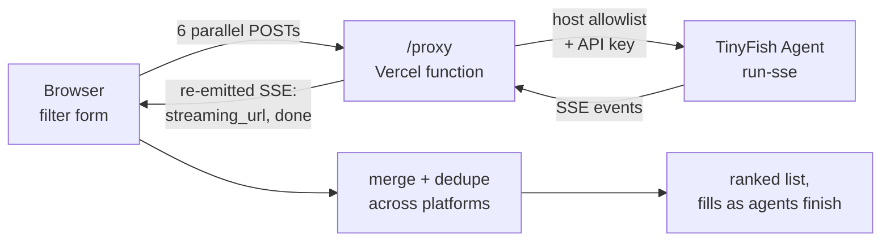

# Mino — Vehicle Scout

Searches six used-car marketplaces at once with browser agents, streams each one's findings back as it works, and merges them into a single ranked list.

**Live:** [vehicle-scout-mino.vercel.app](https://vehicle-scout-mino.vercel.app)

---

## The problem

Used-car listings in India are split across OLX, Cars24, CarDekho and CarWale, with no shared inventory and no common filter vocabulary. Buying means running the same search six times in six tabs and reconciling the results by hand.

There is no API for any of them, so this uses browser agents instead: six run in parallel against six marketplaces, each told the same search criteria in plain language, each returning structured listings.

The interesting constraint is that agent runs take 30–60 seconds. Waiting for all six before showing anything would mean a minute of blank screen, so results stream in per-platform and the page fills as each agent finishes.

---

## Architecture



**Stack:** single-file vanilla HTML/CSS/JS frontend · one Node serverless function on Vercel · TinyFish Agent API (SSE) · no build step, no framework, no database.

---

## Design decisions

### The server exists only to hold the key

The frontend is one static `index.html`. The only reason `server.js` exists is that calling the agent API directly from the browser would ship the API key to every visitor. The function does three things: hold the credential, restrict what can be asked of it, and translate the upstream event stream into one the page can consume.

**Rejected alternative:** letting the browser call the API with a public key. Convenient, and it gives away billable credits to anyone who opens devtools.

### Server-sent events, not polling

Agent runs take 30–60 seconds. The upstream `run-sse` endpoint emits progress events including a `STREAMING_URL` — a live view of the browser the agent is driving — and that URL is forwarded to the page the moment it arrives, so the user sees the agent working rather than a spinner.

The proxy re-emits its own SSE stream rather than piping the upstream one through, because upstream event shapes vary (`text`, `content`, `output`, `result` all appear) and the page shouldn't have to know about that. Normalisation happens in one place.

`X-Accel-Buffering: no` is set because proxies will otherwise buffer the whole response and defeat the point.

### Partial line handling

SSE arrives in arbitrary chunks, so a `data:` line can be split across two TCP reads. The parser keeps the trailing incomplete line in a buffer and only processes complete ones — the bug this avoids is silently dropping every event that happens to straddle a chunk boundary.

### Extraction is a regex over accumulated text

Agent output is accumulated into one string, then the first `[...]` block is matched and `JSON.parse`d. This is the weakest part of the design and it is a deliberate trade: a strict output schema would be more reliable but adds latency per run, and six runs already sit close to the function's 58-second timeout.

**Consequence:** if an agent prefixes its JSON with prose containing a bracket, extraction picks up the wrong span and the platform silently returns zero listings. See limitations.

### Failure is per-platform, not global

Each agent is a separate request with its own error path. A timeout or parse failure on Craigslist leaves the other five unaffected — the page shows what succeeded rather than an error.

---

## Security

This repository previously contained a live TinyFish API key as a string literal in `server.js`, and the `/proxy` endpoint accepted any target URL from any origin. Both are fixed on the current branch:

- The key is read from `process.env.TINYFISH_API_KEY` and the function fails closed without it.
- Targets are restricted to an allowlist of the six marketplace hosts, https only. Without this the endpoint is an open relay that spends the owner's credits on anyone's behalf.
- `Access-Control-Allow-Origin: *` is removed; the page and function ship in one deployment and the endpoint is same-origin.
- The `goal` string is length-bounded.

**The leaked key is in git history and must be rotated at the provider.** Removing it from the working tree does not unpublish it.

---

## Running it

```bash
npm install
npx vercel dev
```

`/proxy` is a serverless function, so a plain static server will not exercise the search path.

| Variable | Required | Purpose |
| --- | --- | --- |
| `TINYFISH_API_KEY` | Yes | Agent API credential. Set in Vercel project settings, never in source. Key from [agent.tinyfish.ai](https://agent.tinyfish.ai) |

---

## `POST /proxy`

```jsonc
// request
{ "url": "https://www.cardekho.com/used-cars", "goal": "…search criteria…" }
```

Responds with an event stream:

| Event | Payload |
| --- | --- |
| `streaming_url` | `{ url }` — live view of the agent's browser session |
| `done` | `{ listings: [...] }` — extracted listings, possibly empty |
| `error` | `{ message }` — upstream failure or 58s timeout |

Rejects any `url` outside the allowlist with `400`.

---

## Project structure

```
vehicle-scout-mino/
├── index.html      # entire frontend: filter form, goal builder, SSE client, merge + render
├── server.js       # /proxy — key custody, host allowlist, SSE normalisation
├── vercel.json     # /proxy → function, / → static
└── .env.example
```

The search prompt is assembled in `buildGoal()` in `index.html`, which hard-constrains location because agents otherwise return listings from anywhere in the country regardless of the city asked for.

---

## Known limitations

- **JSON extraction is brittle.** First-bracket-match over free text. Prose containing `[` breaks it and the platform returns empty with no error.
- **No accuracy measurement.** How often each platform returns usable listings, and how often extraction silently fails, has never been measured. Logging per-platform success rates across ~50 searches is the obvious next step and would turn every claim on this page into a number.
- **58-second ceiling.** Bounded by the Vercel function timeout. Slow platforms get cut off.
- **No deduplication across platforms.** The same car cross-posted to OLX and CarDekho appears twice.
- **No result caching.** Every search costs six fresh agent runs, which is the main cost driver.
- **Agent credits are consumed per search** with no rate limiting beyond the host allowlist. An authenticated or per-IP limit is needed before this is genuinely public.
- **No tests.**
